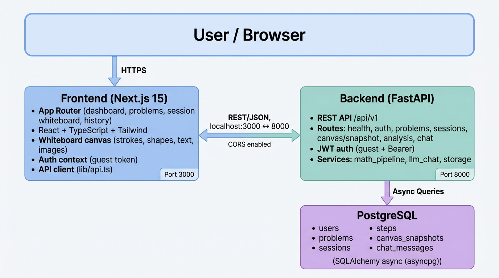

# Digital Math Teacher — System Architecture

## Overview

The app is a full-stack system: a **Next.js** frontend talks to a **FastAPI** backend over REST; the backend uses **PostgreSQL** for persistence. Auth is guest-based (JWT). Canvas state is saved as snapshots; analysis and chat are wired to stub/real services.

## Architecture Diagram



## Text Diagram (Mermaid)

You can render this in GitHub, VS Code (with Mermaid extension), or [mermaid.live](https://mermaid.live).

```mermaid
flowchart TB
    subgraph Client[" "]
        User[User / Browser]
    end

    subgraph Frontend["Frontend (Next.js 15)"]
        App[App Router]
        Pages[Dashboard · Problems · Session · History · Settings]
        Whiteboard[Whiteboard Canvas]
        AuthCtx[Auth Context]
        APIClient[API Client]
        App --> Pages
        Pages --> Whiteboard
        AuthCtx --> APIClient
    end

    subgraph Backend["Backend (FastAPI)"]
        API[REST API /api/v1]
        Routes[health · auth · problems · sessions · canvas · analysis · chat]
        Auth[JWT Auth]
        Services[math_pipeline · llm_chat · storage]
        API --> Routes
        Routes --> Auth
        Auth --> Services
    end

    subgraph Data["PostgreSQL"]
        Tables[(users · problems · sessions · steps · canvas_snapshots · chat_messages)]
    end

    User --> Frontend
    Frontend <-->|REST / JSON · CORS| Backend
    Backend -->|SQLAlchemy async (asyncpg)| Data
```

## Components

| Layer        | Tech              | Purpose |
|-------------|-------------------|--------|
| **Frontend**| Next.js 15, React, TypeScript, Tailwind, Radix UI | SPA: dashboard, problem list, session whiteboard, persistence UI, chat |
| **Backend** | FastAPI, Uvicorn  | REST API, auth, sessions, snapshots, analysis, chat (SSE) |
| **Database**| PostgreSQL        | Users, problems, sessions, steps, canvas_snapshots, chat_messages |

## Data Flow (summary)

1. **Auth:** Browser → `POST /api/v1/auth/guest` → backend creates user + JWT → frontend stores token, sends `Authorization: Bearer` on requests.
2. **Problems:** Frontend → `GET /api/v1/problems` (and `GET /problems/{id}`) → backend reads from PostgreSQL.
3. **Sessions:** Create via `POST /api/v1/sessions` (with or without `problem_id`). List via `GET /api/v1/sessions`. Session page loads `GET /api/v1/sessions/{id}` and `GET .../snapshot`.
4. **Canvas:** Whiteboard edits → debounced autosave → `PUT /api/v1/sessions/{id}/snapshot` (strokes_json, width, height). On 500, fallback to localStorage.
5. **Analysis:** Frontend → `POST /api/v1/analysis/steps` (session_id, optional snapshot_id) → backend (stub/real pipeline) → steps returned.
6. **Chat:** Frontend → `POST /api/v1/chat` (SSE stream); history via `GET /api/v1/chat/{session_id}`.

## Ports

- **Frontend:** `http://localhost:3000`
- **Backend API:** `http://localhost:8000` (docs: `/docs`)
- **PostgreSQL:** default `5432` (config via `DATABASE_URL` in backend `.env`)
